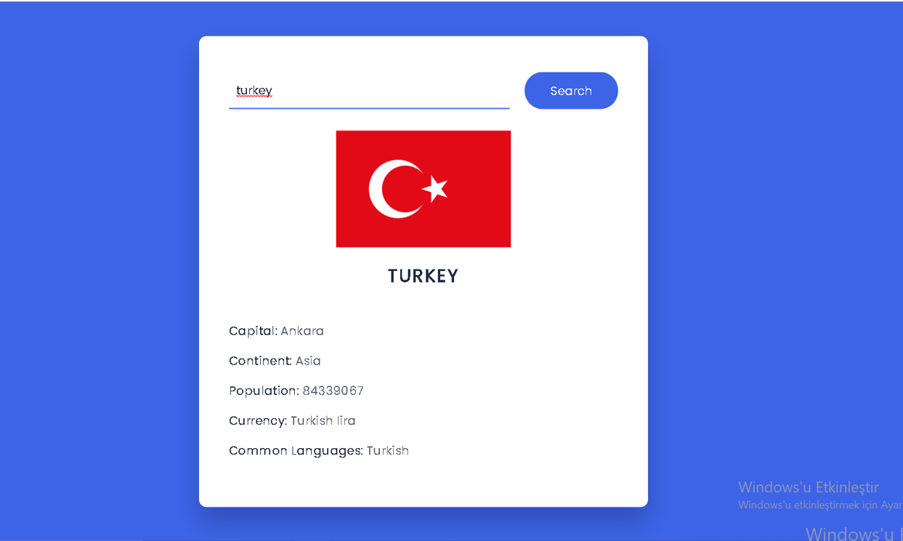
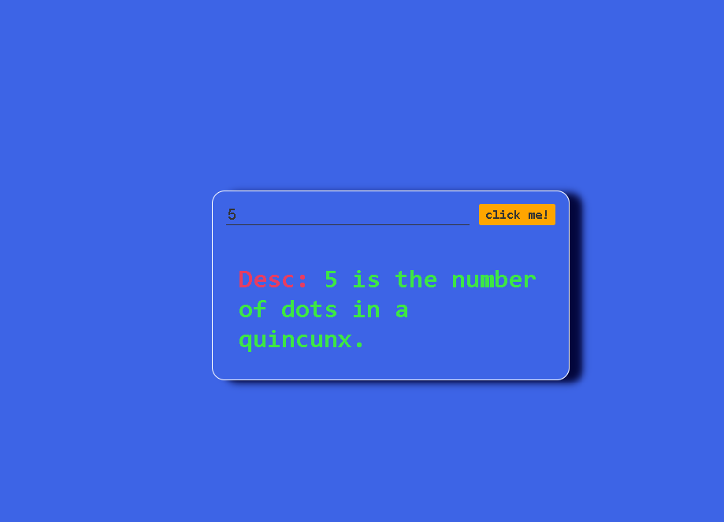
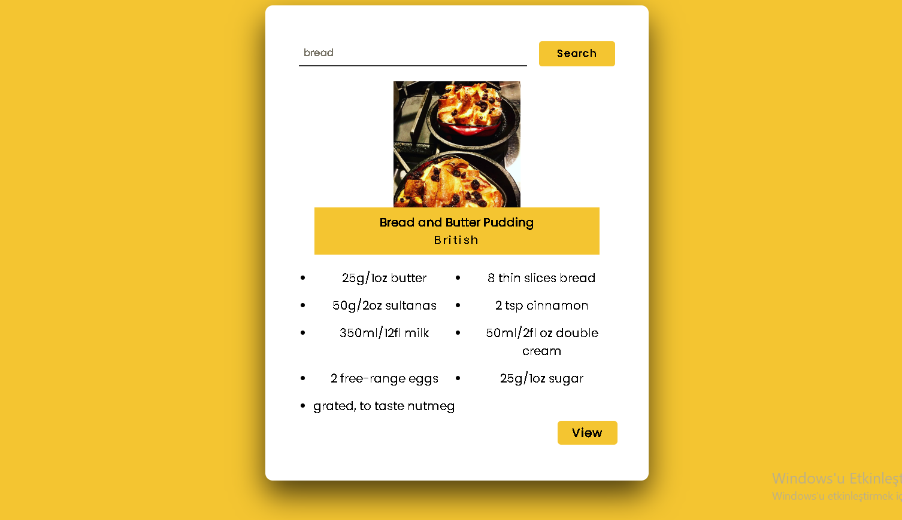
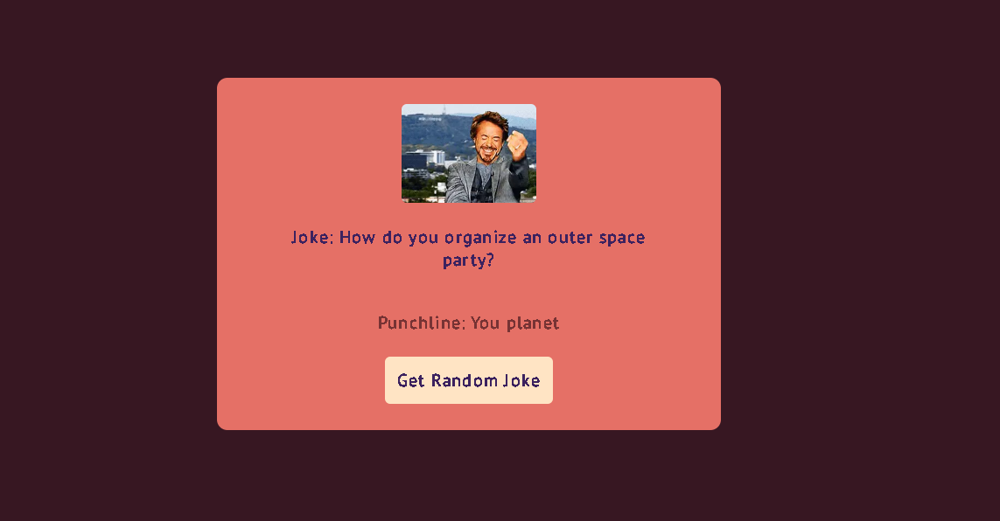
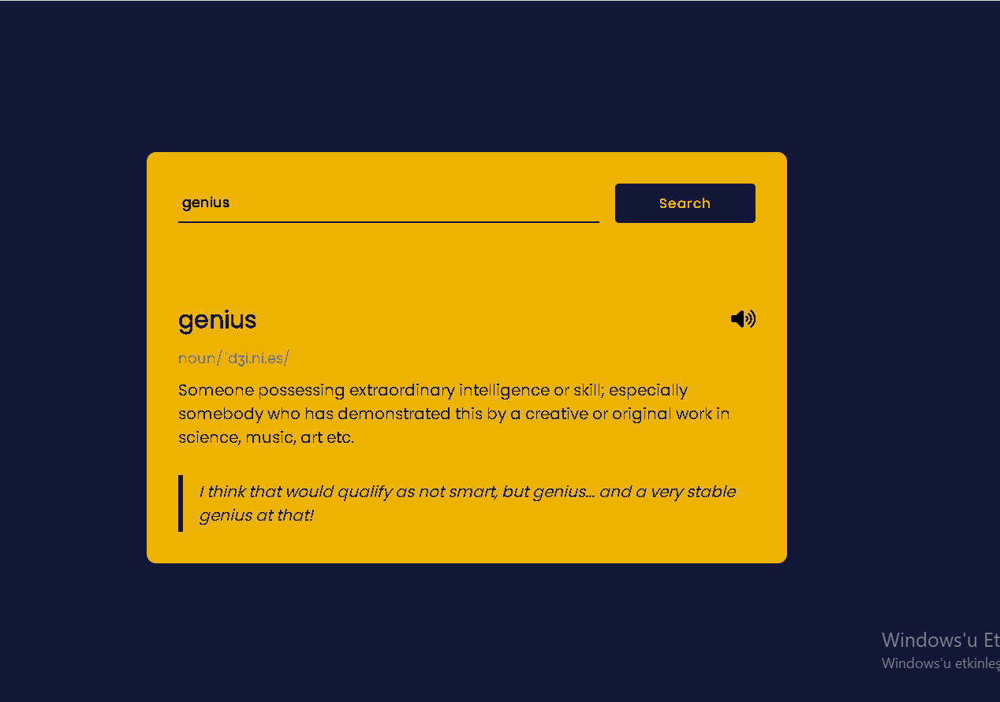

# country-API

Bu projede ülkeler hakkında bilgi veren bir uygulama yaptım.

## Uygulama özellikleri

1. Proje responsive yapıdadır.

2. Aranılan ülkenin bayrağı, ismi, nüfusu, dili, para birimi hakkında bilgiler verilmektedir.

#### Projede faydalanılan API linki için [tıklayınız.](https://restcountries.com/)

numberAPI projesi eklendi.

# meal-API

Bu projede herhangi bir yemek hakkında bilgiler içeren bir app yapıldı.

#### Projede faydalanılan API linki için [tıklayınız.](https://www.themealdb.com/api.php)

### Proje görseli 

# number-API

Bu projede herhangi bir sayı hakkında bilgiler içeren bir app yapıldı.

#### Projede faydalanılan API linki için [tıklayınız.](http://numbersapi.com/#4)

### Proje görseli 

# randomjoke-API

Bu projede butona her basıldığında farklı bir şaka ekrana gelmektedir. 😂

#### Projede faydalanılan API linki için [tıklayınız.](https://official-joke-api.herokuapp.com/random_joke)

### Proje görseli 

# dictionary-API

Bu projede istediğiniz kelimeleri aratıp anlamlarını, telafuzlarını öğrenebilirsiniz.

#### Projede faydalanılan API linki için [tıklayınız.](https://dictionaryapi.dev/)

### Proje görseli 

